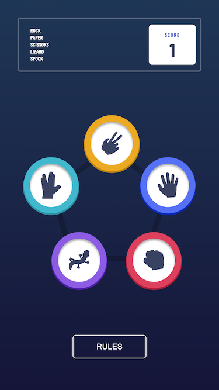
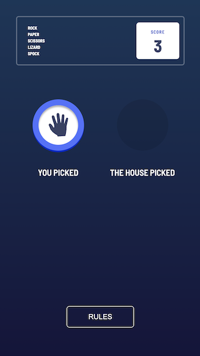
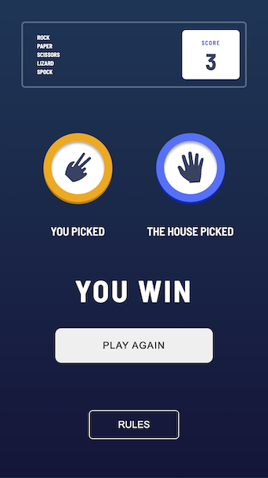
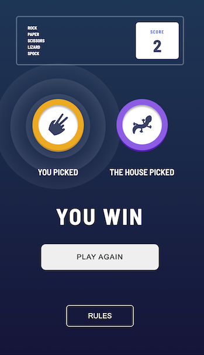
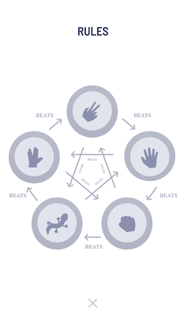
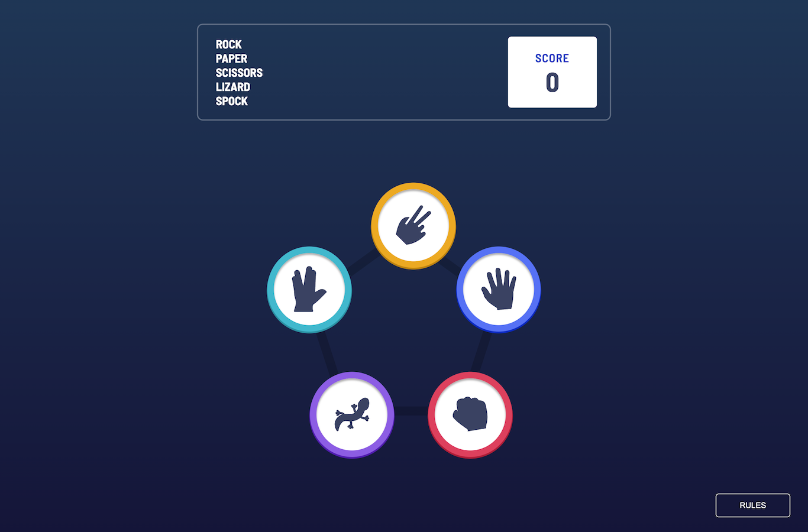
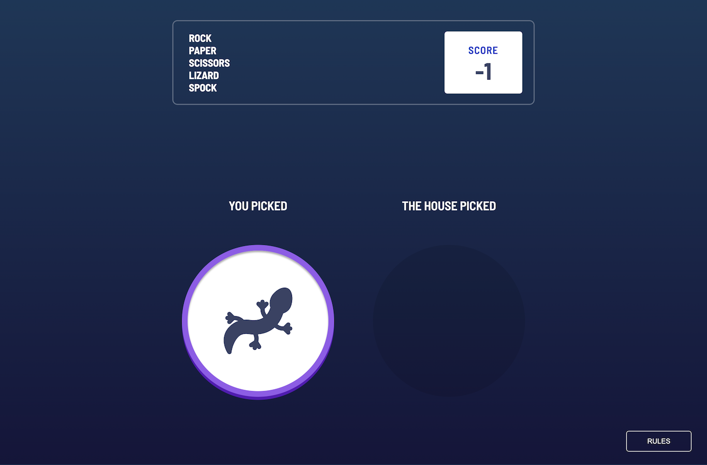
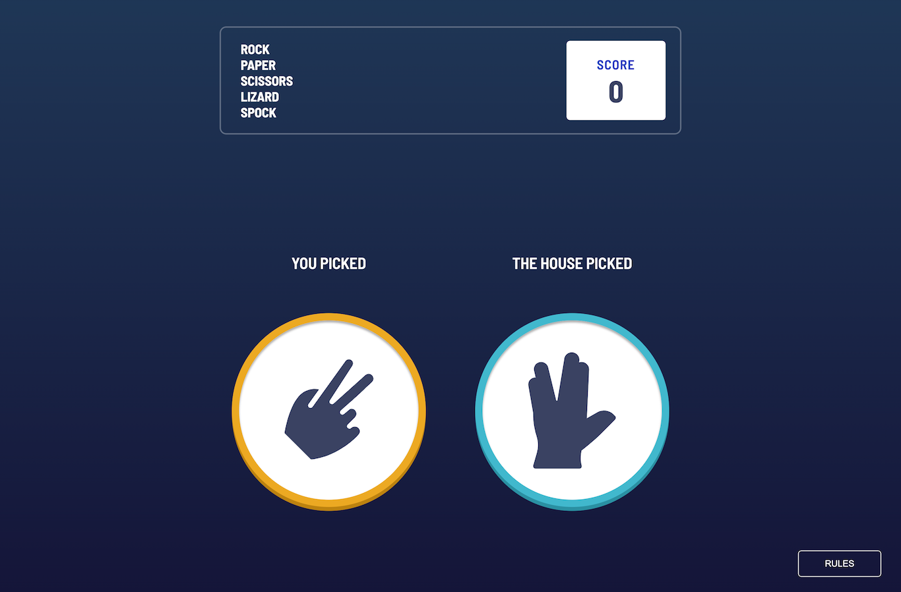
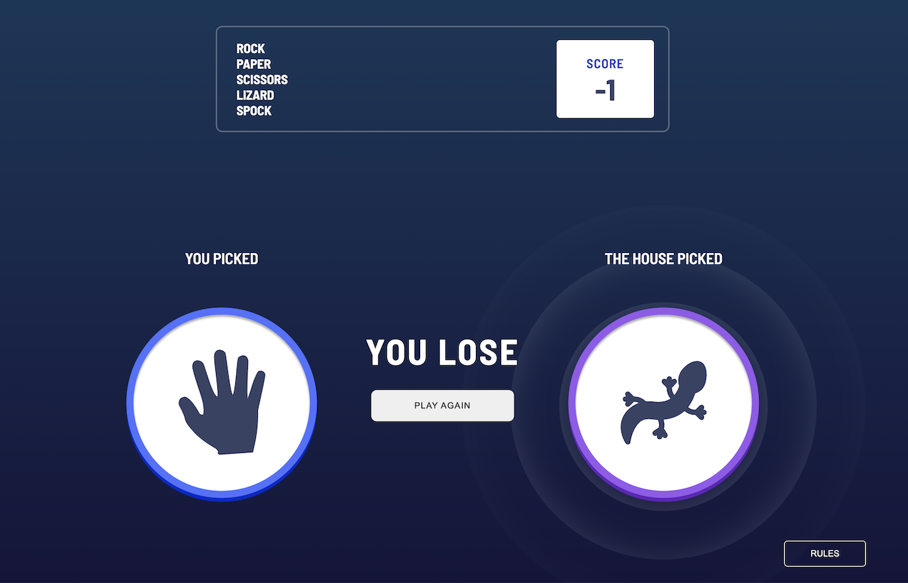
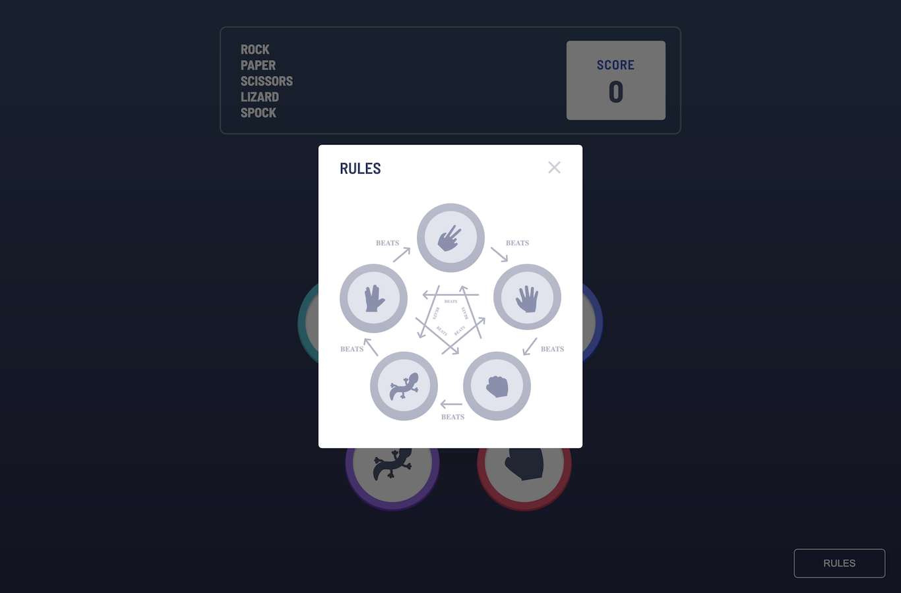

# Rock Paper Scissors Lizard Spock Game

Rock, Paper, Scissors, Lizard, Spock Game

## Table of contents

- [Rock Paper Scissors Lizard Spock Game](#rock-paper-scissors-lizard-spock-game)
  - [Table of contents](#table-of-contents)
  - [Overview](#overview)
    - [The challenge](#the-challenge)
    - [Screenshot](#screenshot)
    - [Links](#links)
  - [My process](#my-process)
    - [Built with](#built-with)
    - [Setup](#setup)
    - [What I learned](#what-i-learned)
    - [Continued development](#continued-development)
    - [Useful resources](#useful-resources)
  - [Author](#author)
  - [Acknowledgments](#acknowledgments)

## Overview

### The challenge

Users should be able to:

- View the optimal layout for the game depending on their device's screen size
- Play Rock, Paper, Scissors against the computer
- Maintain the state of the score after refreshing the browser (optional)
- Bonus: Play Rock, Paper, Scissors, Lizard, Spock against the computer (optional)

### Screenshot












### Links

- Rock, Paper, Scissors game challenge: [Rock, Paper, Scissors game challenge page](https://www.frontendmentor.io/challenges/rock-paper-scissors-game-pTgwgvgH)

## My process

### Built with

- Semantic HTML5 markup
- CSS custom properties
- Flexbox
- CSS Grid
- Mobile-first workflow
- Responsive design
- [SASS](https://sass-lang.com/) - For styles
- [BEM](https://getbem.com/) - For reusable components

### Setup

1. Install Live Server and Live Sass Compiler on vscode.
2. Open Watch Sass

### What I learned

1. @keyframes
Use the @keyframes CSS at-rule controls the intermediate steps in a CSS animation sequence by defining styles for keyframes (or waypoints) along the animation sequence.
```html
<div class="center">
  <div class="loading">
    <span></span>
    <span></span>
    <span></span>
    <span></span>
    <span></span>
    <span></span>
  </div>
</div>
```
```css
.center {
    position: absolute;
    top: 50%;
    left: 50%;
    transform: translate(-50%, -50%);
}

.loading {
    position: relative;
    width: u.rem(288);
    height: u.rem(288);
    display: flex;
    align-items: center;
    justify-content: center;

    @include u.breakpoint(large) { 
        width: u.rem(754);
        height: u.rem(754);
    }
}

.loading span {
    position: absolute;
    border-radius: 50%;
    animation: deep-looping-circle 2.5s linear infinite;
    animation-play-state: paused;
}

.loading span:nth-child(1) {
    animation-delay: 0s;
}
.loading span:nth-child(2) {
    animation-delay: 0.5s;
}
.loading span:nth-child(3) {
    animation-delay: 1s;
}
.loading span:nth-child(4) {
    animation-delay: 1.5s;
}
.loading span:nth-child(5) {
    animation-delay: 2s;
}
.loading span:nth-child(5) {
    animation-delay: 0s;
}

@keyframes deep-looping-circle {
  0% {
      width: 0;
      height: 0;
      opacity: 0;
      box-shadow: inset 0 0 50px hsla(237, 82%, 37%, 0.1);
  }
  
  50% {
      opacity: 0.3;
      box-shadow: inset 0 0 50px hsla(0, 0%, 100%, 0.8);
  }

  100% {
      width: 100%;
      height: 100%;
      opacity: 0;
      box-shadow: inset 0 0 50px hsla(237, 82%, 37%, 0.1);
  }
}
```

2. The animation-play-state CSS property sets whether an animation is running or paused.
```js
playerLoopingCircles.forEach(circle => {
    circle.style.animationPlayState = "paused";
})
houseLoopingCircles.forEach(circle => {
    circle.style.animationPlayState = "paused";
})

const showDeepLoopingCircles = (result) => {
    if (result === 1) {
        playerLoopingCircles.forEach(circle => {
            circle.style.animationPlayState = "running";
        })
    }
    if (result === -1) {
        houseLoopingCircles.forEach(circle => {
            circle.style.animationPlayState = "running";
        })
    }
}
```

3. Use the 'inset' value to set inner box shadow.
```css
box-shadow: inset 0 u.rem(3) u.rem(3) hsla(0, 1%, 60%, 0.8);
```

4. Get the style value of a specific element.
```js
const playerInnerCircle = document.querySelector(".playerInnerCircle");
const innerBoxShadow = window.getComputedStyle(playerInnerCircle, null).getPropertyValue("box-shadow");
```

5. Set the style value of an element.
```js
const houseInnerCircle = document.querySelector(".houseInnerCircle");
houseInnerCircle.style.boxShadow = innerBoxShadow;
```

### Continued development

- Keep optimizing this App.

### Useful resources

- [Deep Looping Circle Animation with CSS and HTML Code](https://www.youtube.com/watch?v=bj6X8sf-1ng&list=LL&index=11)

## Author

- Website - [Oliver C.](https://github.com/iberis9611)
- Frontend Mentor - [@iberis9611](https://www.frontendmentor.io/profile/iberis9611)

## Acknowledgments
